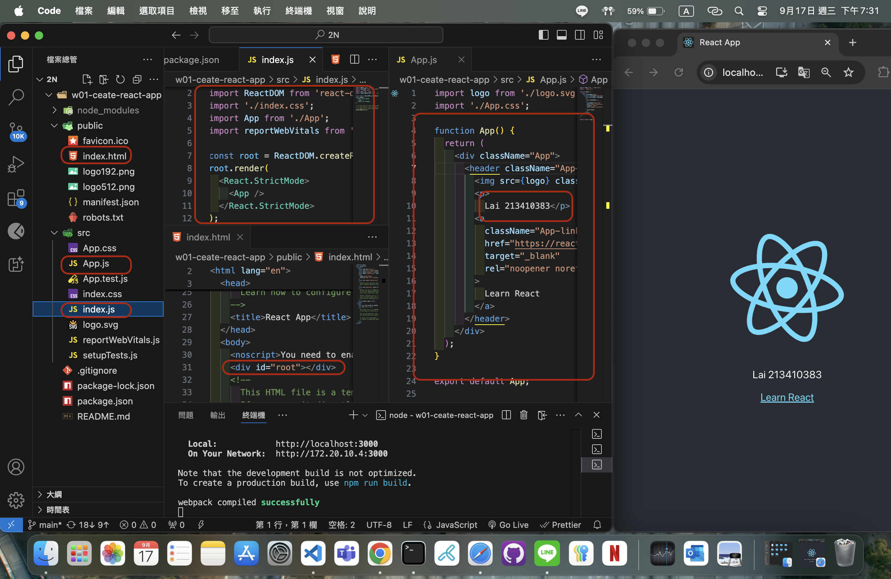
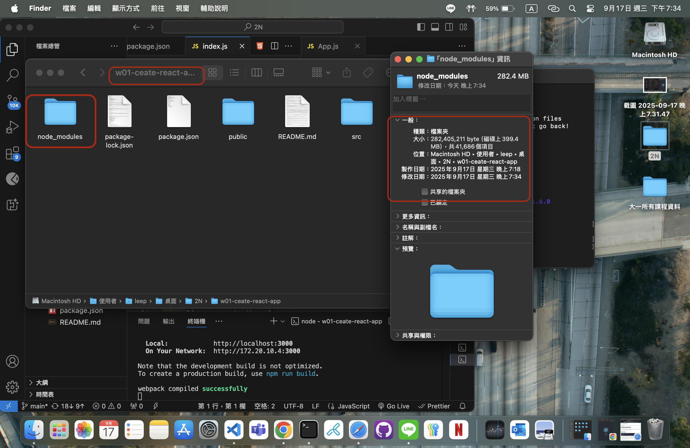
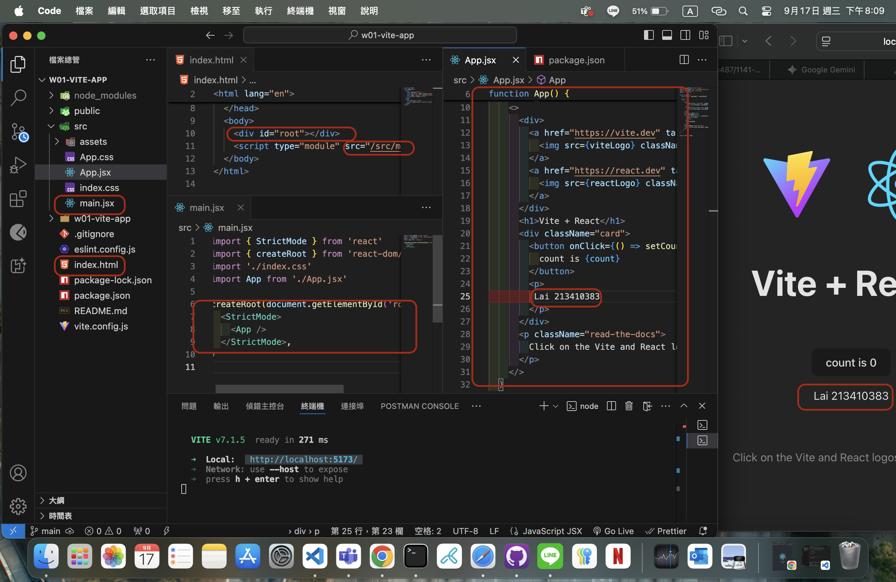
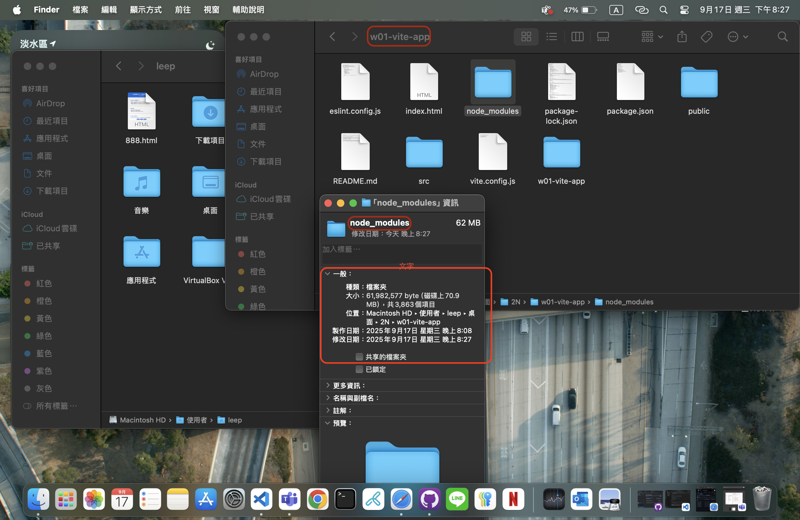
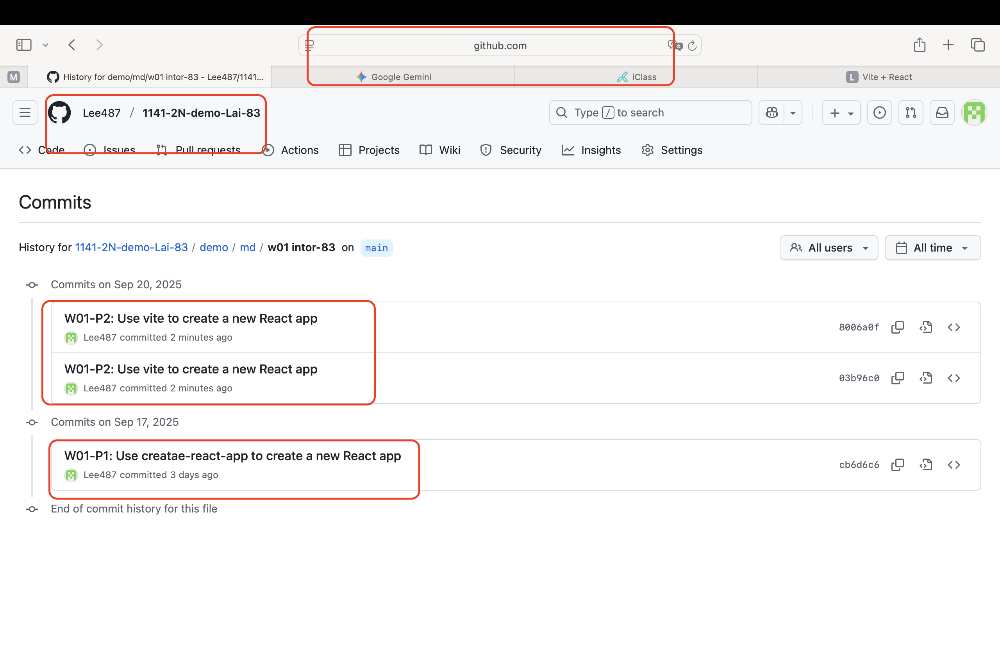
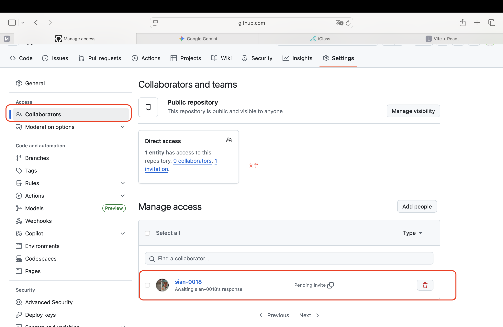

[Github URL](https://github.com/Lee487/1141-2N-demo-Lai-83.git)

### W01-P1: Use creatae-react-app to create a new React app

#### => show how the index.html page being rendered



#### => share the size 



```
cb6d6c6 Lee487  Wed Sep 17 20:19:02 2025 +0800  W01-P1: Use creatae-react-app to create a new React app
```


### : W01-P2: Use vite to create a new React app
 
#### => show how the index.html page being rendered
 

 
#### => share the size of node module
 

 
```

```


### W01-logs: git logs of W01 and share to htchung@gms.tku.edu.tw (teacher) and sian-0018 (TA)
 

 
