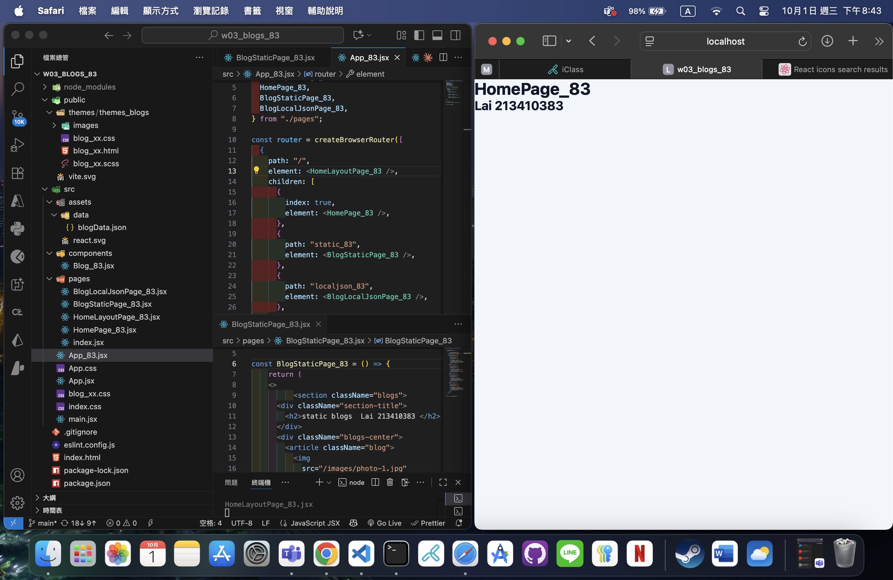
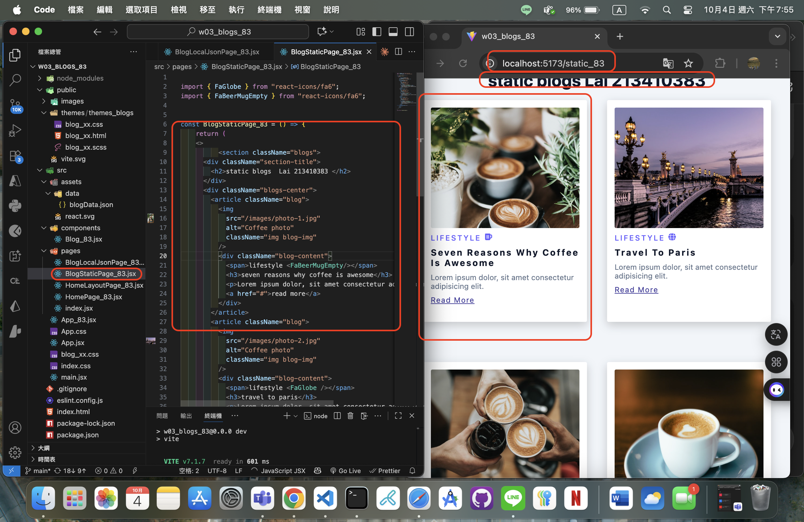
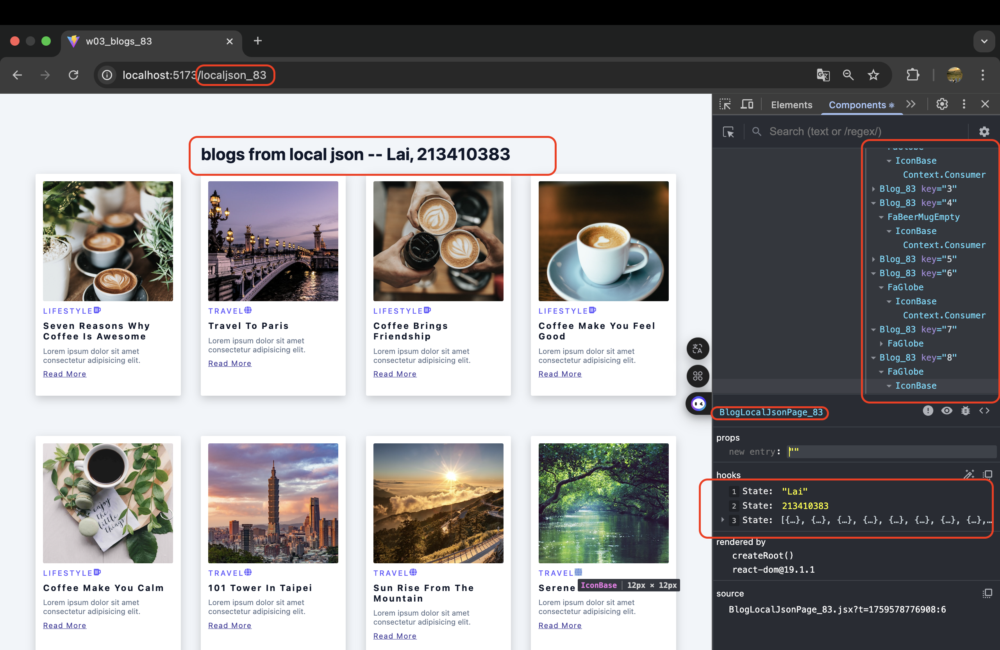

[Github URL](https://github.com/Lee487/1141-2N-demo-Lai-83.git)

### W03-P1: Create router in App_xx.jsx
 
#### => route / for HomePage_xx
 

 
#### => route /static_xx for BlogStaticPage_xx
 

 
```
cb09611 Lee487  Sat Oct 4 20:10:37 2025 +0800    W03-P1: Create router in App_xx.jsx
```
### W03-P2: Implement route /static_xx for BlogStaticPage_xx
 

 
```
ab5af10 Lee487  Sat Oct 4 20:11:16 2025 +0800    W03-P2: Implement route /static_xx for BlogStaticPage_xx
```
### W03-P3: Implement route /localjson_xx by showing blogs from local json
 
#### => Chrome demo using React DevTools
 

 
#### => code for BlogLocalJson_xx
 

 
```
7e7a5e7 Lee487  Sat Oct 4 20:14:09 2025 +0800   W03-P3: Implement route /localjson_xx by showing blogs from local json
```

