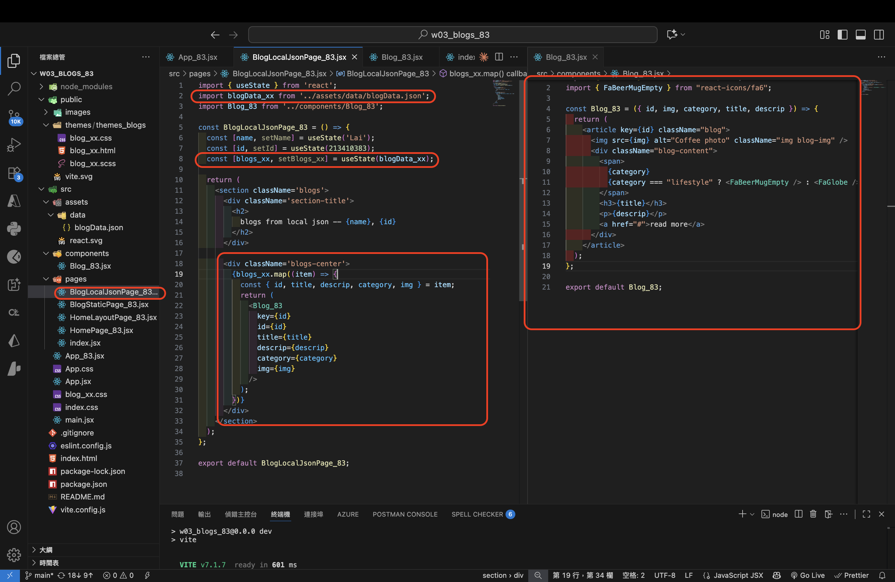

[Github URL](https://github.com/Lee487/1141-2N-demo-Lai-83.git)

### W03-P1: Create router in App_xx.jsx
 
#### => route / for HomePage_xx
 

 
#### => route /static_xx for BlogStaticPage_xx
 

 
```

```
### W03-P2: Implement route /static_xx for BlogStaticPage_xx
 

 
```

```
### W03-P3: Implement route /localjson_xx by showing blogs from local json
 
#### => Chrome demo using React DevTools
 

 
#### => code for BlogLocalJson_xx
 

 
```


