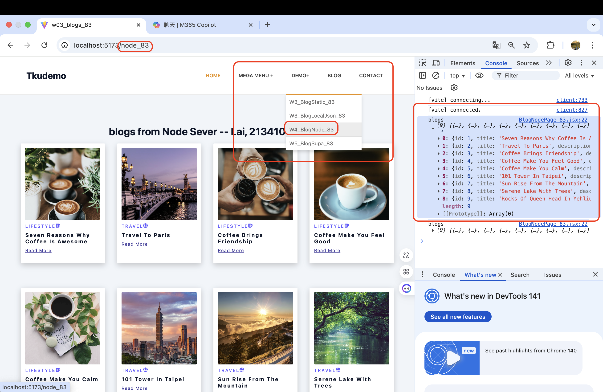
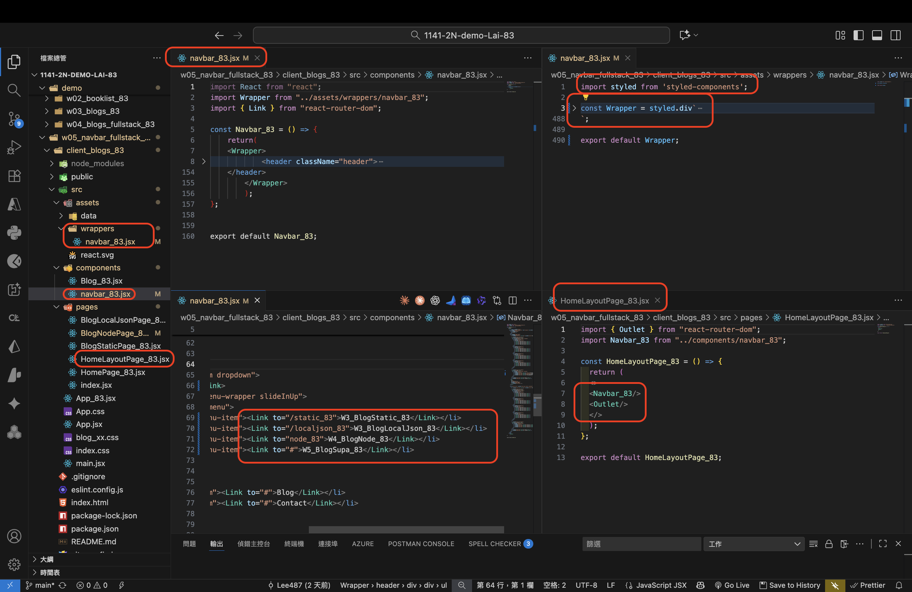
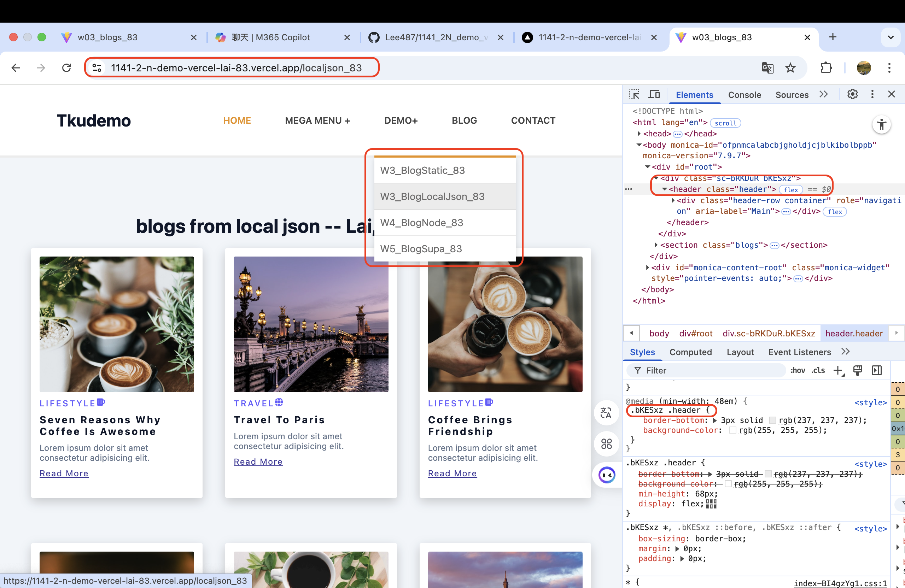
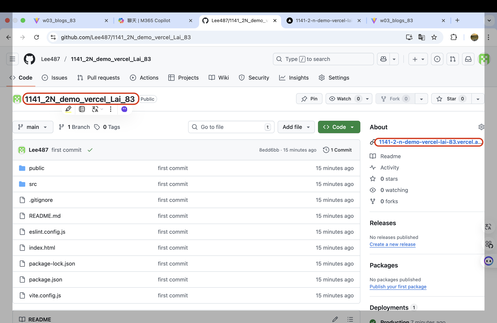
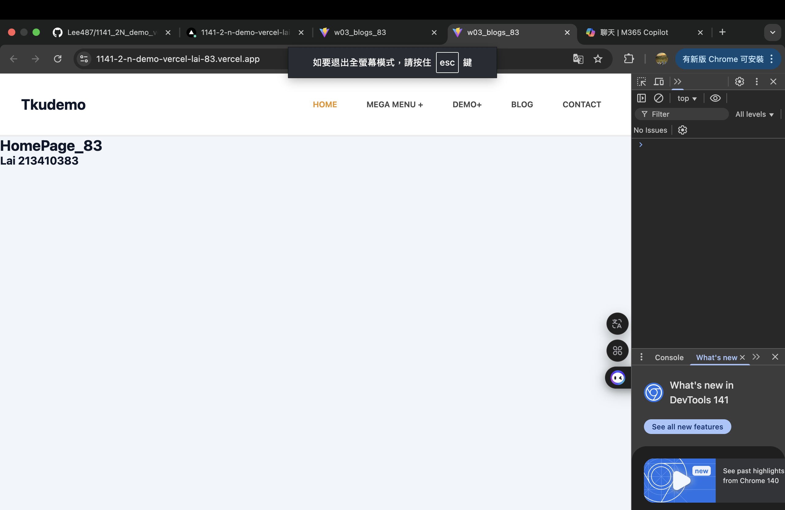
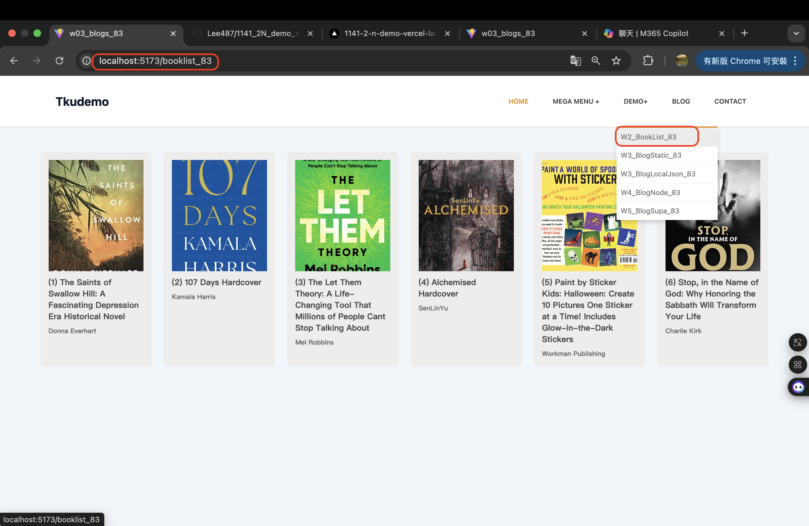

[Github URL](https://github.com/Lee487/1141-2N-demo-Lai-83.git)


### W05-P1: Create Navbar_xx using styled components, and show BlogNodePage_xx
 
##### => Chrome
 

 
##### => relevant code
 

 
```
ed577d5 Lee487  Wed Oct 22 20:16:35 2025 +0800   W05-P1: Create Navbar_xx using styled components, and show BlogNodePage_xx
```

### W05-P2: Deploy the code to Vercel
 
#### => Show BlogLocalJson in Vercel
 

 
#### => Github repo with Vercel link
 

 
#### => Github demo_vecel repo and Vercel URL
 
[Github URL for Vercel](https://1141-2-n-demo-vercel-lai-83.vercel.app/)

 
```
1ea2578 Lee487  Wed Oct 22 20:18:27 2025 +0800  W05-P2: Deploy the code to Vercel
```

### W05-P3: Use tailwind css to show HomePage_xx in Vercel
 

 
```
2d9b753 Lee487  Wed Oct 22 20:20:03 2025 +0800  W05-P3: Use tailwind css to show HomePage_xx in Vercel
```

### W05-P4: Show BookListPage_xx using styled components
 

 
```
760564c Lee487  Wed Oct 22 20:20:42 2025 +0800  W05-P4: Show BookListPage_xx using styled components
```