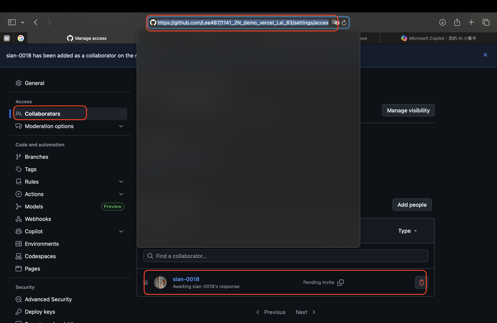
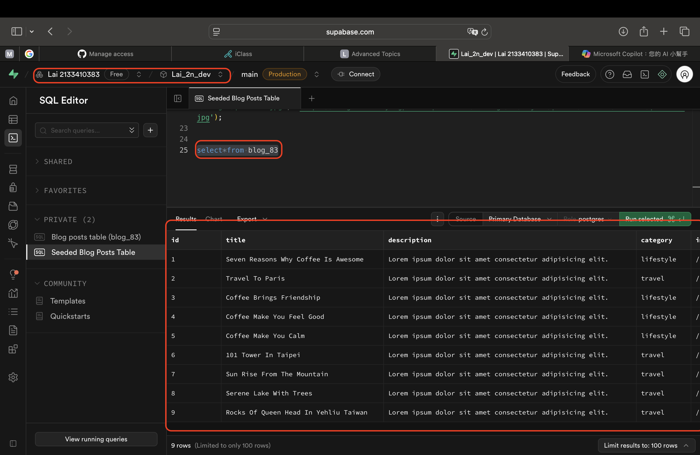
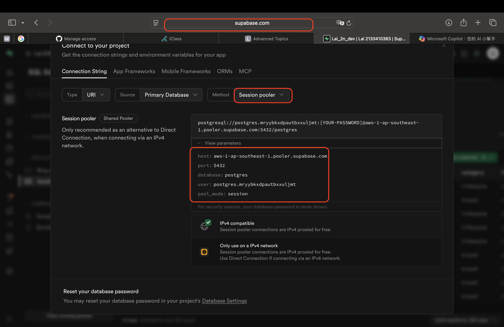
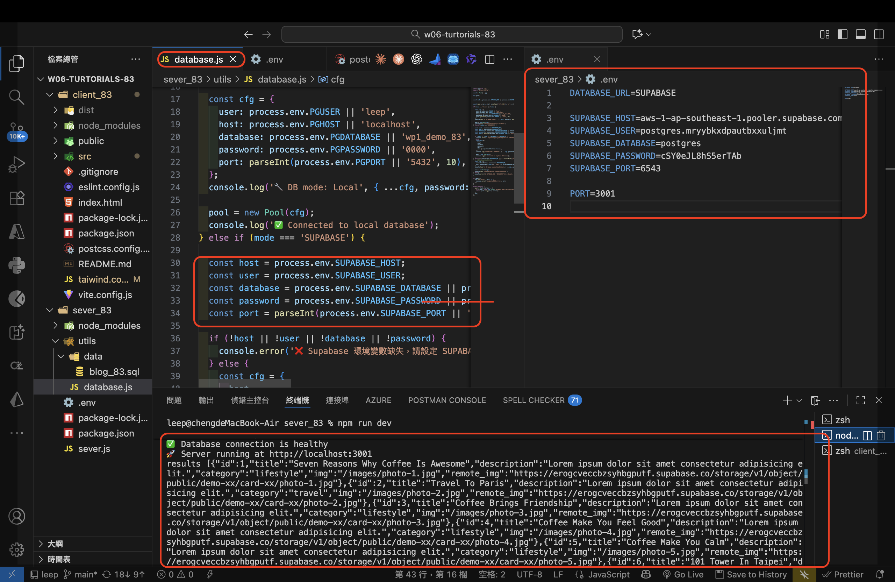
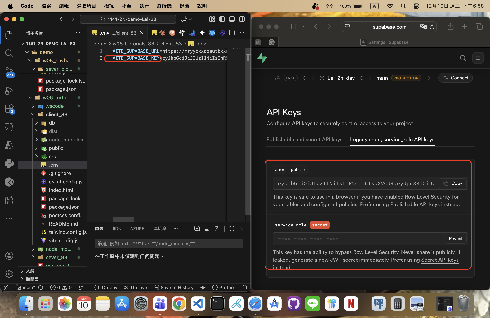
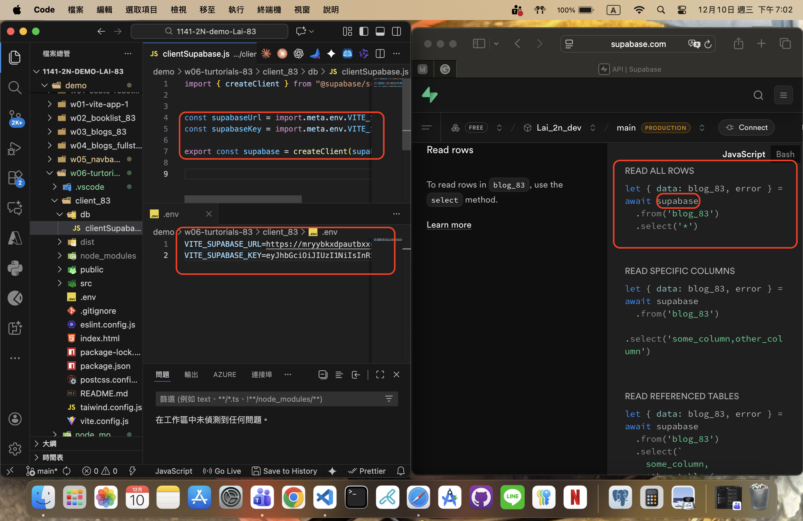
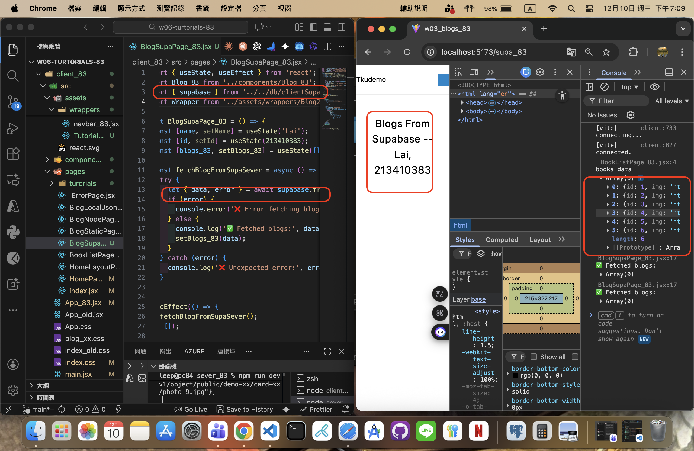
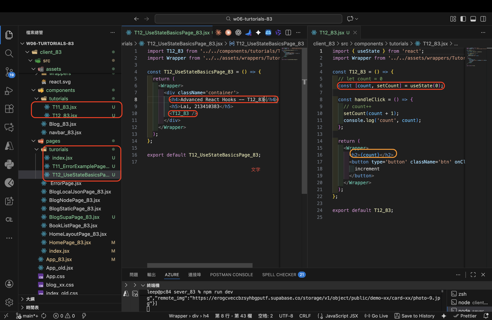
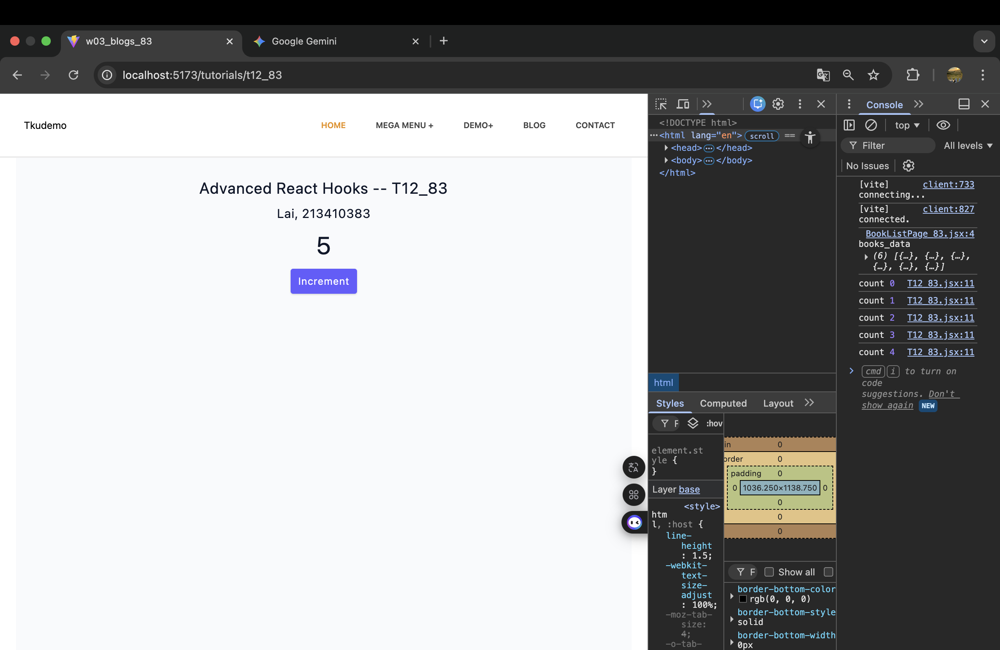

[Github URL](https://github.com/Lee487/1141-2N-demo-Lai-83.git)
[Github URL for Vercel](https://1141-2-n-demo-vercel-lai-83.vercel.app/)


### W06-P1: share URL of Github demo Vercel
 

 
```

```


### W06-P2: Supabase settings in Node.js, can connect to Supabase to get 9 blogs data
 
#### => able to get 9 blogs data in Supabase
 

 
#### => connect parameters in Supabase
 

 
#### => server code in Supabase setting
 

 
```

```

### W06-P3: Use Supabase client to get 9 blogs data
 
#### => show API keys in Supabase
 

 
#### => Supabase client code
 

 
#### => Use BlogSupaPage_xx.jsx to get blogs data from Supabase
 

 
```

```


### W06-P4: Implement Tutorial T11_xx and T12_xx
 
#### => show code for T12_xx
 

 
#### => Chrome result
 

 
```

```