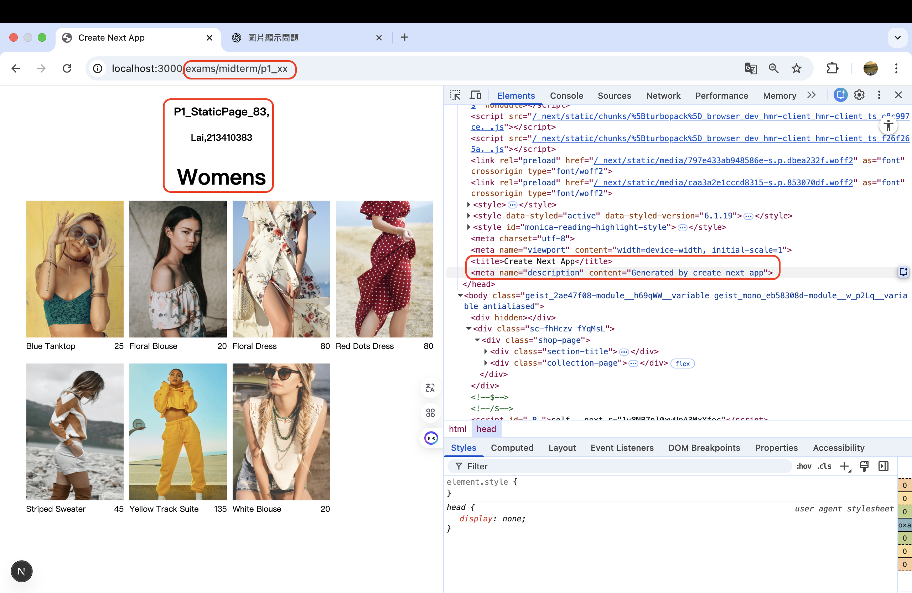
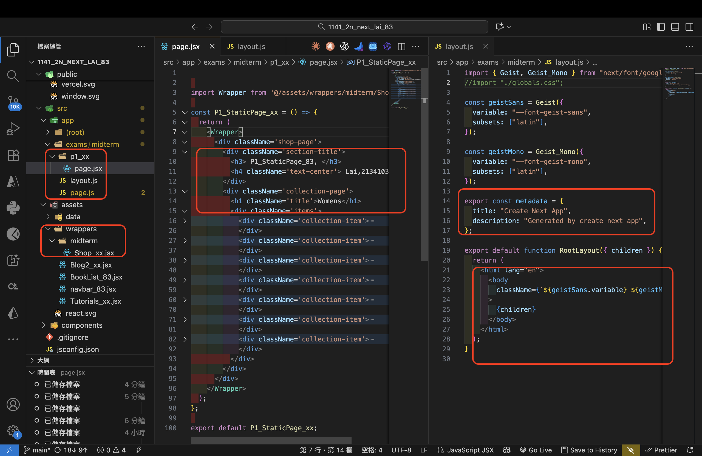
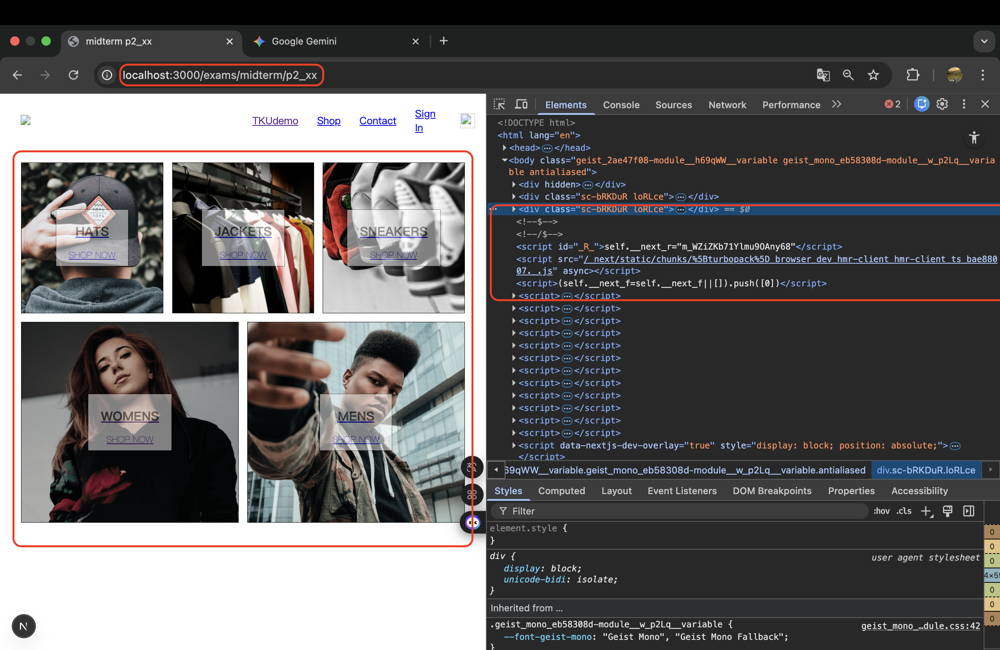
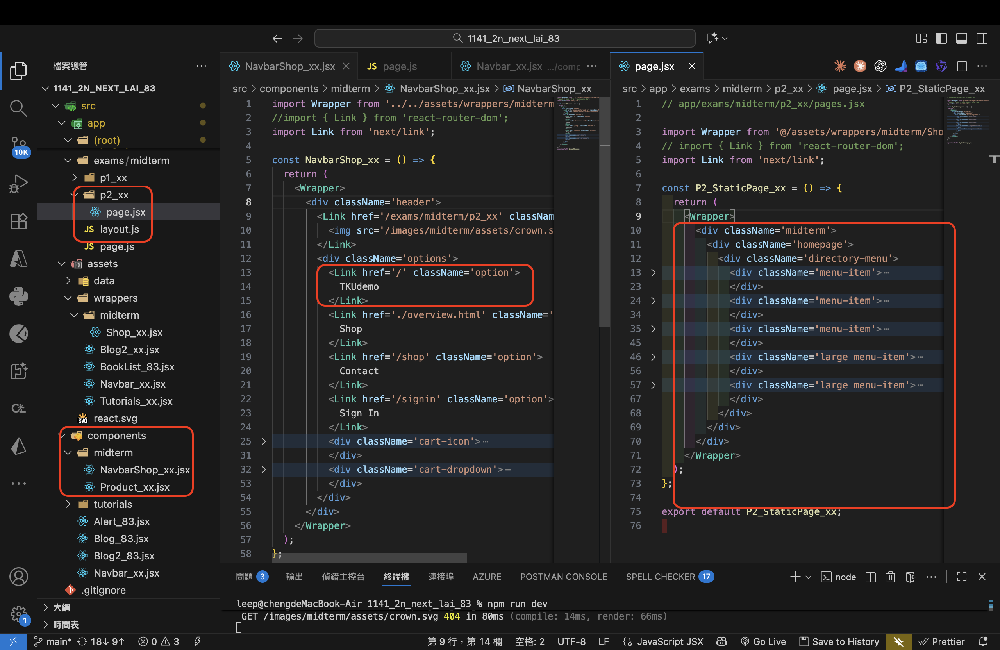
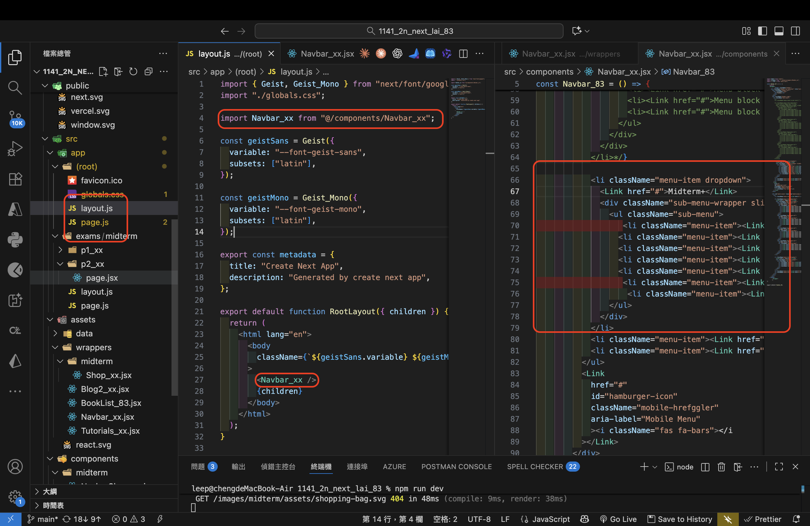

[Github URL](https://github.com/Lee487/1141-2N-demo-Lai-83.git)
[Github URL for Vercel](https://1141-2-n-demo-vercel-lai-83.vercel.app/)


### W10-P1: implement /exams/midterm/p1_xx for P1 in mid-1
 
##### => Chrome, show P1 page with meta data
 

 
##### => show the relevant code
 


 
```
903ba1e Lee487  Sun Nov 23 19:39:35 2025 +0800   W10-P1: implement /exams/midterm/p1_xx for P1 in mid-1
```

### W10-P2: Implement /exams/miderm/p2_xx for P2 in mid-1
 
#### => shown in Chrome
 

 
#### => the relevant code for P2
 

 
#### => Navbar_xx for root layout
 

 
```
77ea854 Lee487  Sun Nov 23 19:40:17 2025 +0800   W10-P2: Implement /exams/miderm/p2_xx for P2 in mid-1
```