[Github URL](https://github.com/Lee487/1141-2N-demo-Lai-83.git)
[Github URL for Vercel](https://1141-2-n-demo-vercel-lai-83.vercel.app/)


### W12-P1: Refine code of /demo/shop_xx/node
 

 
```

```
 

### W12-P2: Deploy code to Vercel
 
#### => npm run build
 
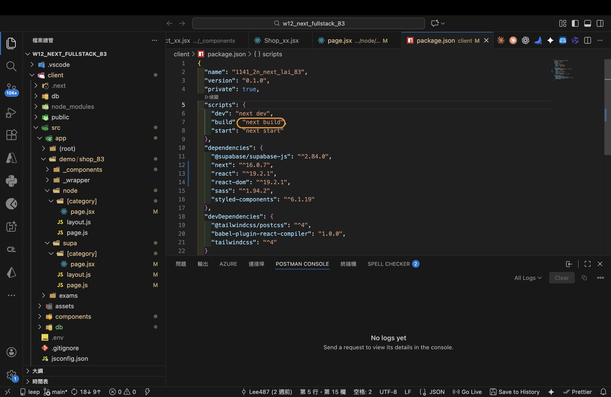
 
#### => npm start
 
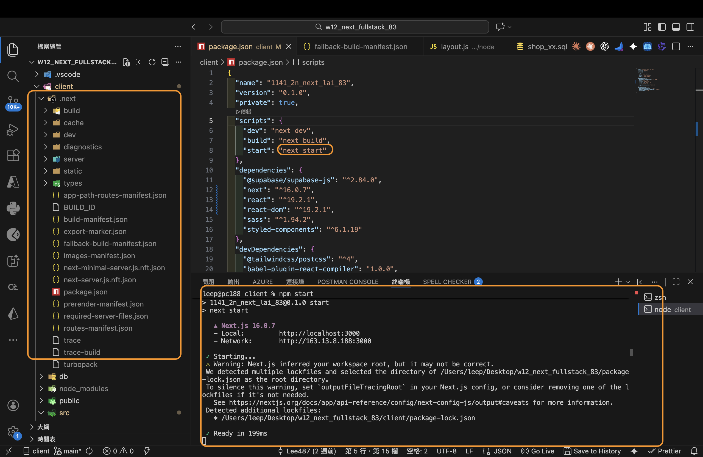
 
#### => Vercel, add environment variables
 
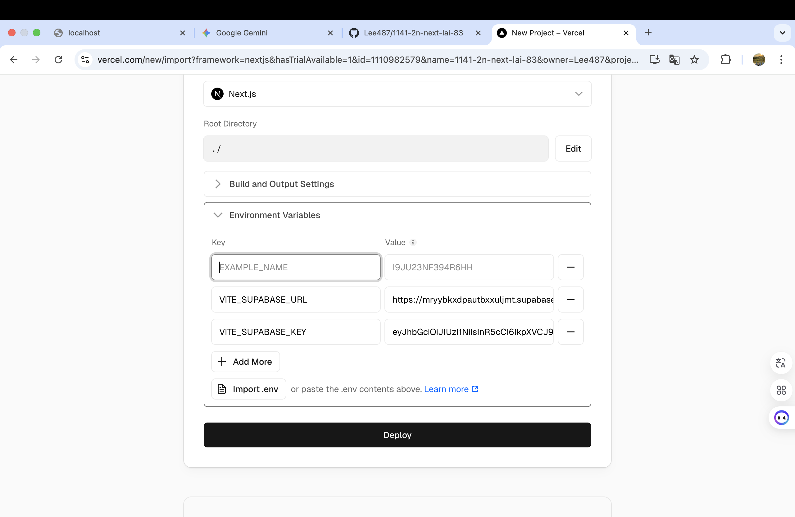
 
#### => Vercel homepage success
 
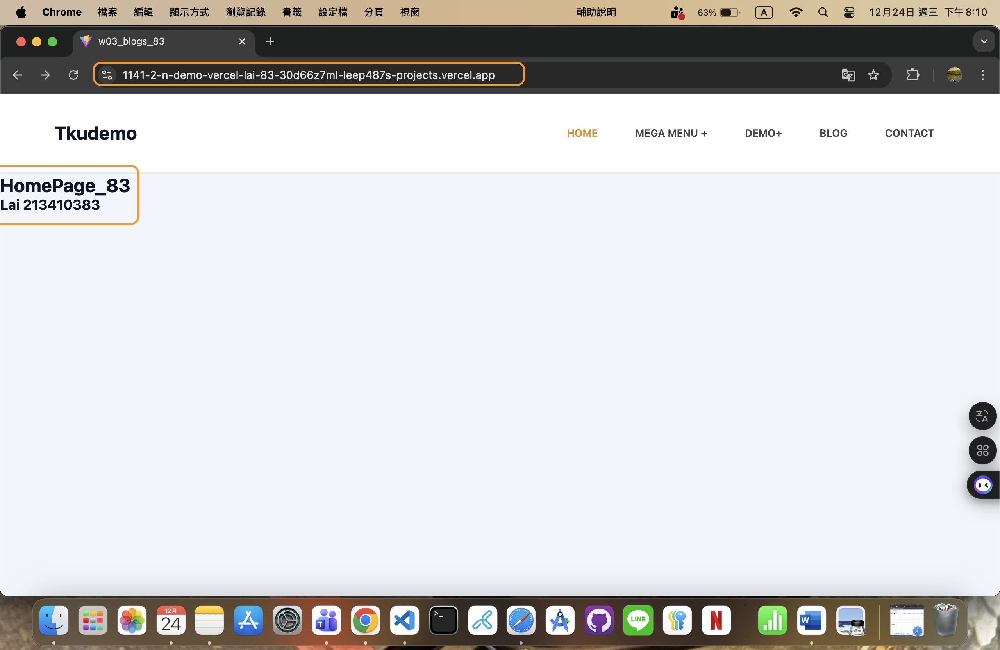
 
#### => Github repo and Vercel URL
 
 
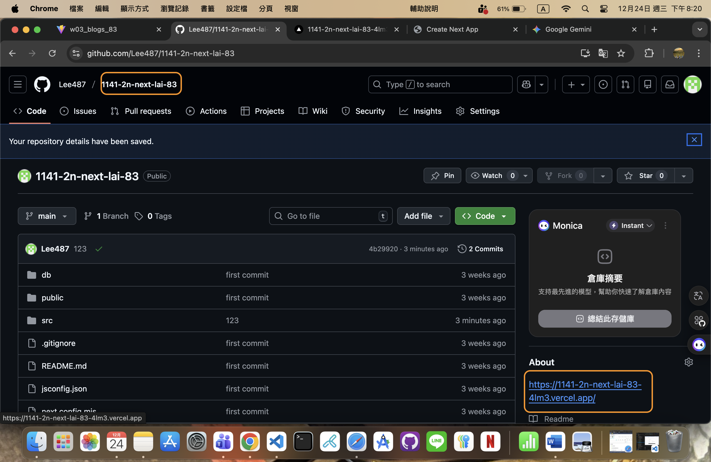
 
#### => Share to teacher and TA
 
 
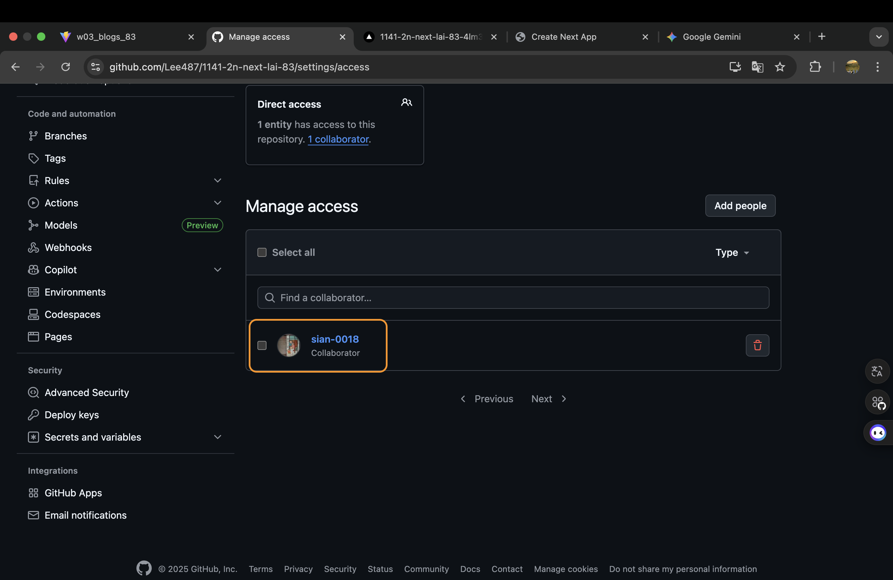
 
```

```


### W12-P3: Implenment /demo/shop2_xx/supabase to fetch products from Supabase
 
#### => use SQL to get category2_xx data
 
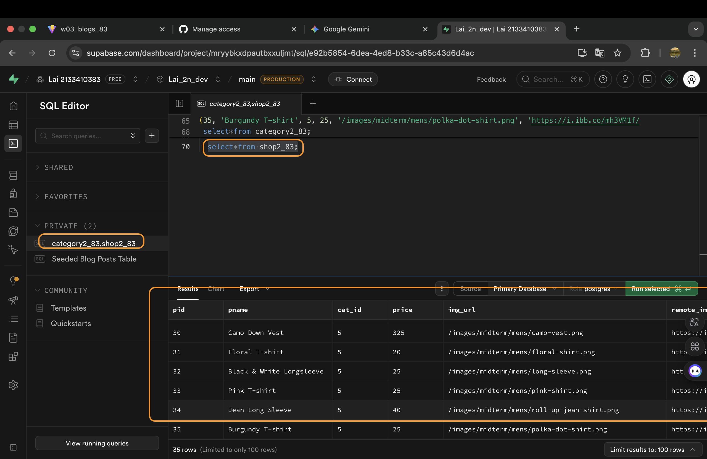
 
#### => use SQL to get shop2_xx data
 
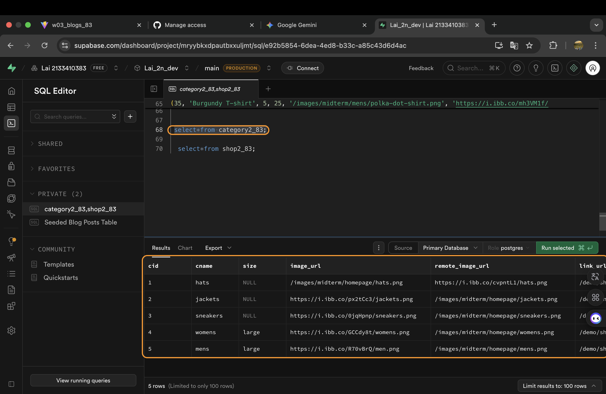
 
#### => set foreign key
 
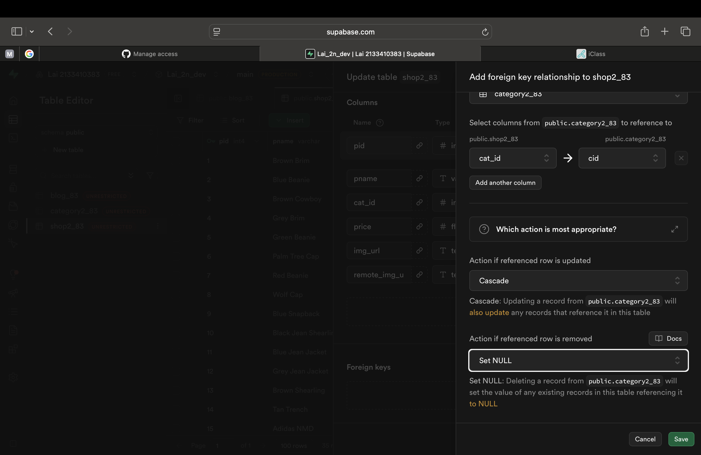
 
#### => set RLS policies for public access for all CRUD
 
 
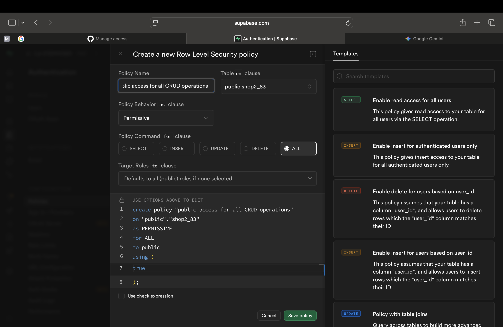
 
#### => Chrome -- local
 
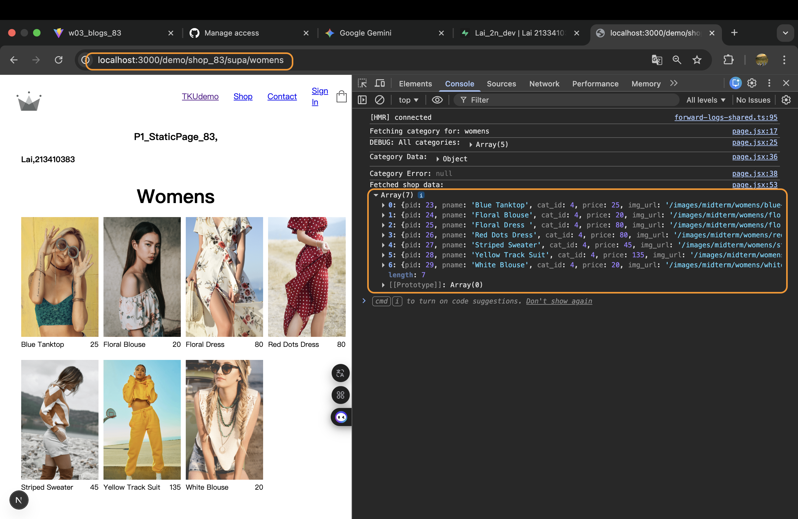
 
#### => Chrome -- Vercel
 
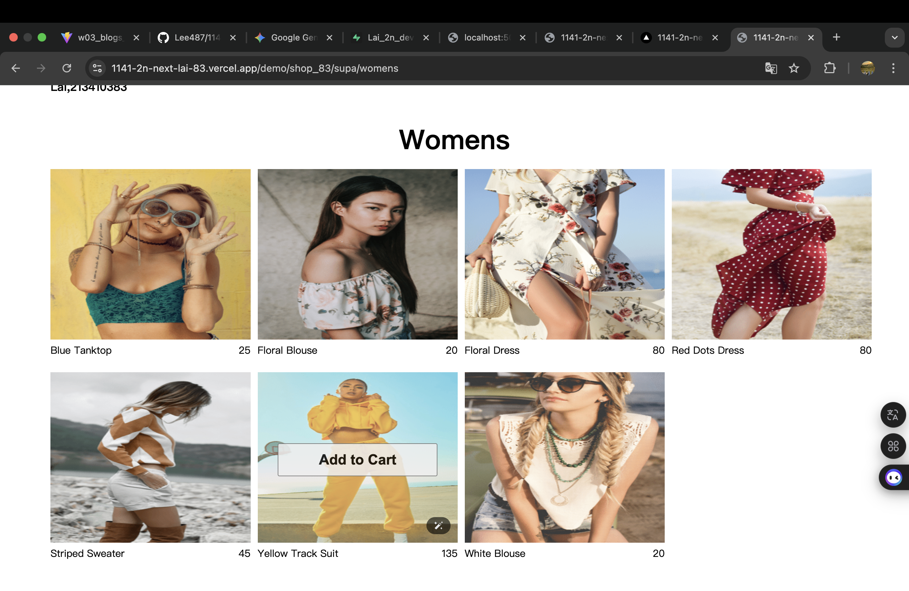
 
```

```